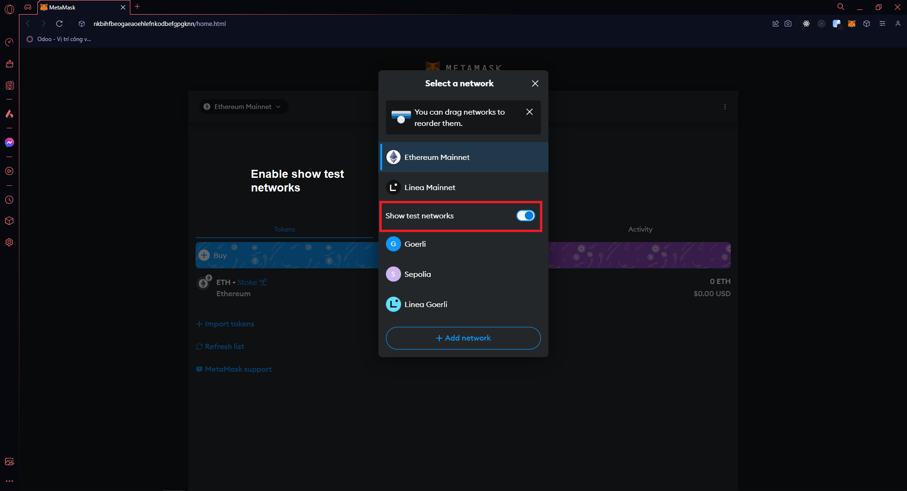
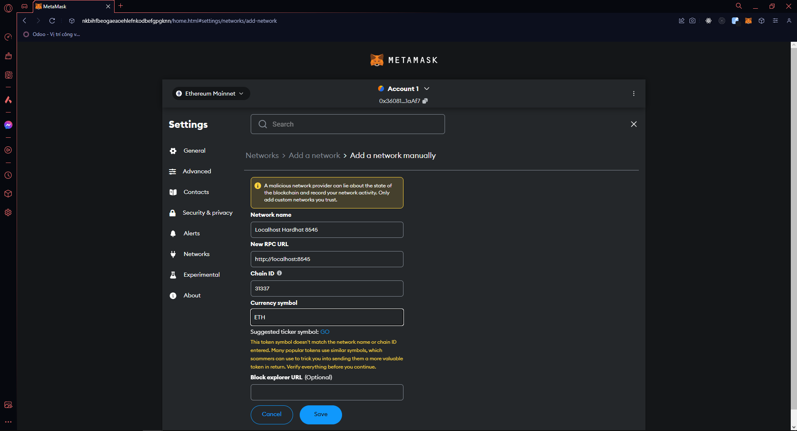
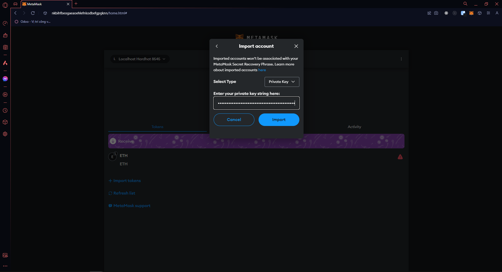

# BLOCKCHAIN GETTING STARTED APP DOCUMENTATION

 

## 💻 Technical Stack

- [React.js](https://react.dev) - The library for web and native user interfaces
- [Hardhat](https://hardhat.org) - Ethereum development environment for professionals
- [Ethers](https://docs.ethers.org/v5/) - The ethers.js library aims to be a complete and compact library for interacting with the Ethereum Blockchain and its ecosystem

## 🔬 Testing Hardhat app command

**NOTE: Skip /contract/ if you already inside folder**

```console
    /contract/npx hardhat test
```

## 💽 Compile Hardhat app command

**NOTE: Skip /contract/ if you already inside folder**

```console
    /contract/npx hardhat compile
```

## 💎 Deploy Hardhat app command

**NOTE: Skip /contract/ if you already inside folder**

* First, run command below

```console
    /contract/npx hardhat node
```

* After that, your app will generate some account with **#number tag** and **private key**
* Now, Choose one & save private key for example: **0xac0974bec39a17e36ba4a6b4d238ff944bacb478cbed5efcae784d7bf4f2ff80**

### Enable show test networks


### Add hardhat networks


### Import new account with private key



## 💡 Connecting a wallet or Dapp to Hardhat Network

**NOTE: Skip /contract/ if you already inside folder**

* Run command below

```console
    /contract/npx hardhat run scripts/sample-script.js --network localhost
```

* After that, your app will deploy with address for example: **0x5FbDB2315678afecb367f032d93F642f64180aa3**
* Remember to **save** address key

## 📦 Run React app client

**NOTE: Skip /front-end/ if you already inside folder**

```console
    /front-end/npm run dev
```